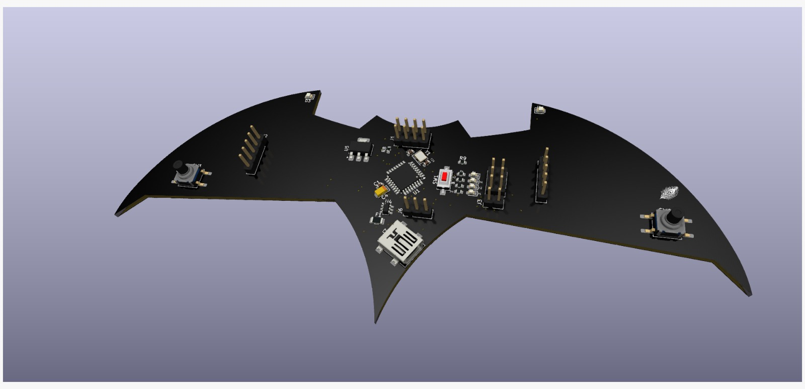

# Transmitter_PCB

A Batman-inspired Batarang-shaped wireless transmitter board featuring an ATmega328P microcontroller, NRF24L01 module, and onboard CH340G USB programmer. Essentially an Arduino with integrated wireless capability and custom PCB design shaped like Batman's iconic throwing weapon.

## PCB Design

## Features

- **ATmega328P Microcontroller** - Same as Arduino
- **NRF24L01 Wireless Module** - 2.4GHz RF Communication
- **CH340G USB Programmer** - Direct programming without external programmer
- **Batarang Shape** - Batman-inspired custom PCB design
- **Full Arduino Compatibility** - Use standard Arduino sketches
- **All Supporting Components** - Crystal oscillator, capacitors, USB connector

## Files

- `Transmitter_PCB.kicad_sch` - Schematic design
- `Transmitter_PCB.kicad_pcb` - PCB layout
- `Transmitter_PCB.kicad_pro` - Project file

## Requirements

- KiCad 6.0 or later
- Arduino IDE (for programming)

## License

MIT